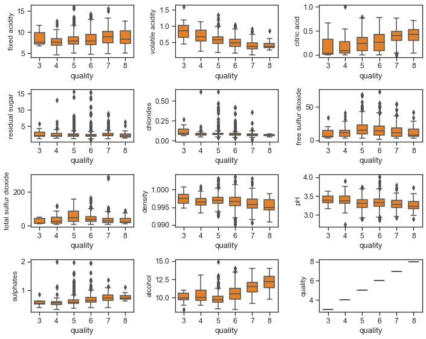

# Seaborn

Using Seaborn to do various drawing exercises

## Univariate Boxplots

## Univariate Histograms

## Acidity Features in log10 Scale

## Histogram

## Physicochemical Properties and Wine Quality by Boxplot

## Pairwise Correlation Plot

## Density vs Alcohol

## pH vs acid

## Scatter Plots of Alcohol, Volatile Acid and Quality

## pH with Fixed Acidity and Citric Acid

